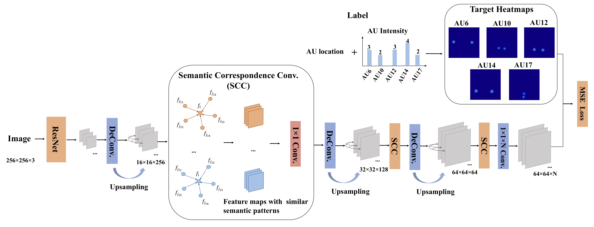
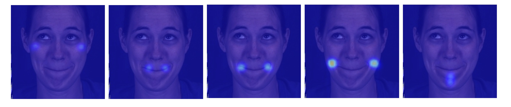

## FAU

Implementation of the paper:

**Facial Action Unit Intensity Estimation via Semantic Correspondence Learning with Dynamic Graph Convolution**. Yingruo Fan, Jacqueline C.K. Lam and Victor O.K. Li.  ***AAAI 2020*** [[PDF]](https://aaai.org/Papers/AAAI/2020GB/AAAI-FanY.6827.pdf)

## Overview

<p align="center">

</p>

## Environment
- Ubuntu 18.04.4
- Python 3.7
- Tensorflow 1.14.0

## Dependencies
Check the packages needed or simply run the command
```console
❱❱❱ pip install -r requirements.txt
```

***Demo***
```console
❱❱❱ python test.py --gpu 1 --epoch 10 --vis True
```
Then, the visualized heatmaps will be generated in the vis_dir folder. An example is as follows:

<p align="center">

</p>

***Training***
```console
❱❱❱ python train.py --gpu 1
```
***Training***
```console
❱❱❱ python test.py --gpu 1 --epoch 10
```

